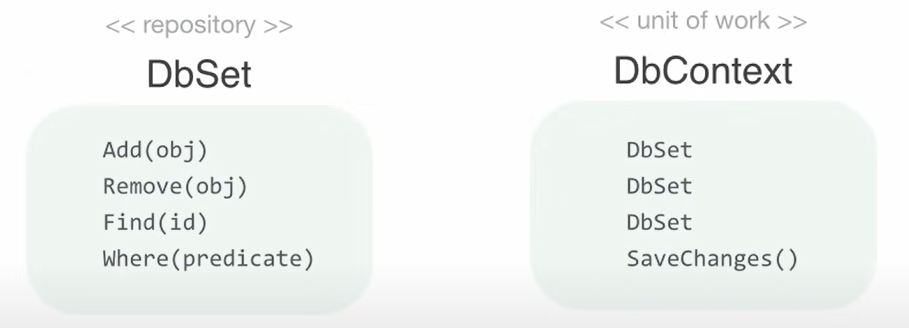

# RepositoryPatternBoilerPlate

Repository Pattern

Repository:- Mediates between the domain and data mapping layers, acting like an in-memory collection of domain objects.

Benefits:- 1. Minimizes duplicate query logic. 2. Decouple your application from the persistence and entity frameworks (Because persistent frameworks change many times and we get new). 3. Promotes Testability.

Repositories should look like, they should act as a collection of objects In memory.

The Repository will not have to update it must be like getting data and updating data, this should not act as the semantics of your DB, it must be like a collection of objects in memory.

The question comes to our mind if a repository acts as a collection of objects in memory then how are we going to save data to the database ? That’s when the Unit of work comes into the picture.

Unit Of Work:- Maintains the list of affected objects by a business transaction and coordinates the writing out of changes.

Many developers argue that Both the repository and Unit of work is already implemented in the entity framework ?

Yes they looks like repository and unit of work but there is hidden problem. 1. It does not minimize the duplicate query logic 2. Modification of application code directly If we want to get rid of entity framework core. 3. Clean Architecture:- The arch should be independent of frameworks. 4. So, Patterns like repository pattern helps you decouple you from frameworks like entity frameworks. 5. Simplicity is the ultimate sophistication.
